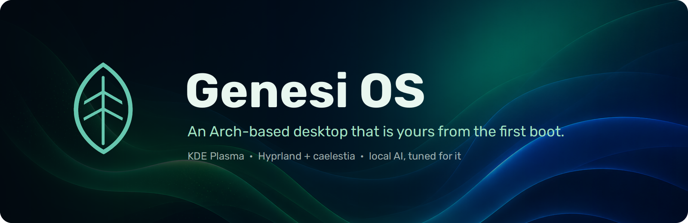
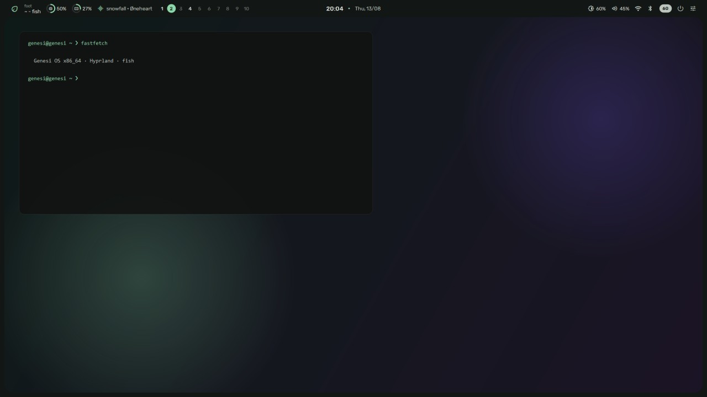
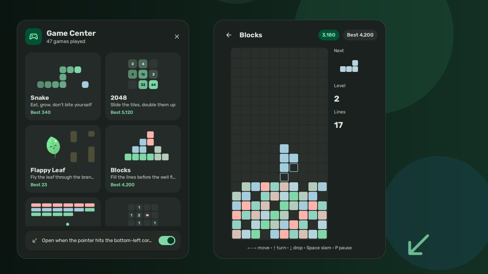
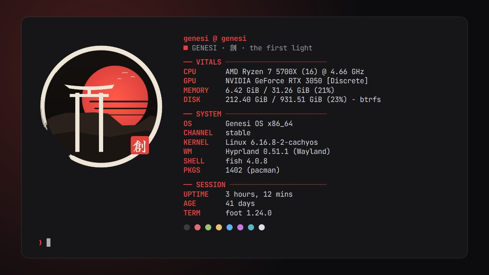
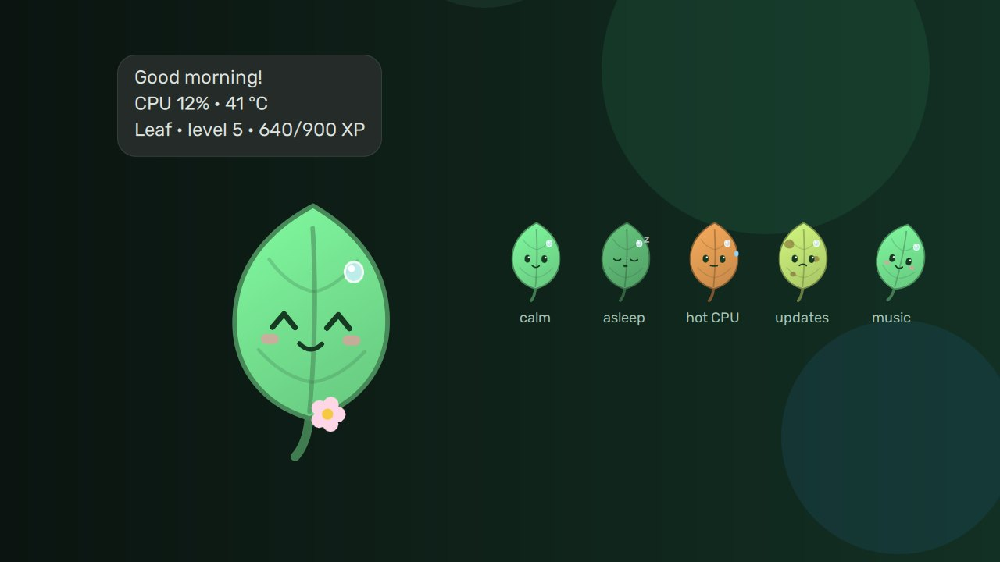

<div align="center">



[](LICENSE)
[](https://cachyos.org)
[](https://github.com/Genesi-OS/GenesiOS/actions/workflows/iso-pipeline.yml)
[](https://github.com/Genesi-OS/GenesiOS/actions/workflows/publish-packages.yml)
[](https://github.com/Genesi-OS/GenesiOS/actions/workflows/hygiene-check.yml)
[](https://forum.genesios.org)

**[Download](#download)** · **[What's inside](#whats-inside)** · **[Install](#install)** · **[How it's built](#how-its-built)** · **[Contributing](#contributing)** · **[Website](https://www.genesios.org)**

</div>

---

Genesi OS is a rolling Linux distribution built on [CachyOS](https://cachyos.org)
and Arch. It installs a finished desktop — themed, configured and with its own
apps — and it treats local AI as a workload the system should tune itself for,
not something to set up by hand.

You pick the desktop in the installer. Two of them are Genesi's own:

- **KDE Plasma 6**, with a glass theme, rounded windows and Genesi's widgets.
- **Hyprland with [caelestia-shell](https://github.com/caelestia-dots/shell)**,
  extended by Genesi with a configurable top bar, a dock, a quick-settings
  panel and optional plugins.

GNOME, Xfce, Cinnamon, Budgie, LXDE, COSMIC and Niri are also offered, with
the Genesi look applied where the desktop allows it.

<table>
  <tr>
    <td></td>
    <td></td>
  </tr>
  <tr>
    <td></td>
    <td></td>
  </tr>
</table>
<p align="center"><sub>Pictures from the Genesi Store's own shelves: the plugin cards are rendered from the plugins' real QML; the bar and terminal cards are drawn from the exact settings each card applies.</sub></p>

## Download

One file, always the latest build of `main`:

```bash
aria2c -x16 -s16 https://pub-917a3befc9e640f0acf8eb3d52633fe2.r2.dev/genesi-os-latest.iso
curl -O https://pub-917a3befc9e640f0acf8eb3d52633fe2.r2.dev/genesi-os-latest.iso.sha256
sha256sum -c genesi-os-latest.iso.sha256
```

The [download page](https://github.com/Genesi-OS/GenesiOS/releases/tag/rolling)
carries the checksum and the changelog for the build you are getting. The link
never changes: the ISO is rebuilt and replaced in place, so there is only ever
one.

| | Minimum | Recommended |
|---|---|---|
| CPU | x86-64 | x86-64-v3 (most CPUs since 2015) |
| Memory | 4 GB | 16 GB or more for local models |
| Storage | 30 GB | 50 GB or more, NVMe |
| GPU | Any — AI Mode also works on CPU | NVIDIA Turing or newer, recent AMD |

## What's inside

### The desktop

| | |
|---|---|
| **Genesi Store** | Themes, wallpapers, login and lock screens, bar styles, Fastfetch themes, plugins and whole desktops — one click each, and one click back. |
| **Genesi Center** | The control centre: system overview, displays, input, appearance, and every setting the desktop has, validated before it is written. |
| **Top bar** (Hyprland) | Six forms — including one that is caelestia's own border grown to hold the bar — and some forty settings: numbered workspaces, resource rings, now playing, tray with menus. |
| **Plugins** (Hyprland) | Off until you turn them on: a Game Center with eight games, a leaf that lives on your screen and reflects the machine's state, live weather on the wallpaper, a turntable for what is playing, and a weekly retrospective. |
| **Snapshots** | Btrfs snapshots before every update, restorable from the boot menu or from the app. |

### Local AI

| | |
|---|---|
| **AI Mode** | A daemon (`genesi-aid`) notices when a model is running — Ollama, llama.cpp, vLLM, LocalAI — and tunes the CPU governor, memory, huge pages, scheduling and I/O for inference. Every change is reverted when the model stops. |
| **Turbo** | llama.cpp builds for Vulkan and CUDA, run with the settings that fit your hardware; any local GGUF works without importing it anywhere. |
| **Mesh** | Pools GPU memory across machines on your network, to run a model none of them fits alone. |
| **MemPalace** | Long-term memory for the local assistant, kept on your machine. |

### For developers

**Genesi Code** (a local-first editor and agentic terminal), **Forge** (a project
hub with a full git client and pipelines), **Sandboxes** (isolated Distrobox
workspaces), **Automations** (event-driven workflows with a visual editor),
**Studio Mode**, **PortScope**, an **API Inspector**, a database client and a
container dashboard.

Everything above ships as one of the 53 packages in the Genesi repository —
the full list, with what each does, is in [`genesi-arch/packages`](genesi-arch/packages).

## Install

1. Write the ISO to a USB drive — `dd` on Linux and macOS, or
   [Ventoy](https://www.ventoy.net) / [Rufus](https://rufus.ie) on Windows.
2. Boot from it, and choose **Install Genesi OS**.
3. Pick your desktop in the installer. If you are unsure, or installing in a
   virtual machine, pick KDE Plasma.

The step-by-step guide is in [docs/installation.md](docs/installation.md), and
the [FAQ](docs/faq.md) covers the common questions.

## Updating

Genesi is rolling: `sudo pacman -Syu`, or the update applet in the tray, which
takes a snapshot first. Two channels are available, switchable at any time with
`genesi-channel`:

- **stable** — built from `main`
- **testing** — built from `develop`, newer and less proven

The `[genesi]` repositories are signed; the public keys ship in
`genesi-keyring`.

## How it's built

Every push to `main` goes through three workflows, kept separate so that a
broken ISO can never stop updates reaching installed machines, and the other
way round:

| Workflow | What it does |
|---|---|
| [Checks](.github/workflows/hygiene-check.yml) | Over fifty guards in [`genesi-arch/ci`](genesi-arch/ci): QML that would fail to load, settings pages wired to keys nothing reads, packages published but installed by nothing, and the regressions each one was written after. |
| [Packages](.github/workflows/publish-packages.yml) | Builds every changed package in a CachyOS container, signs it, and publishes the pacman repository. |
| [ISO](.github/workflows/iso-pipeline.yml) | Resolves and installs the installer's package set into an empty root first, and only builds the ISO if that works. |

To build locally, inside a CachyOS or Arch environment:

```bash
cd genesi-arch/packages && ./build-packages.sh    # the packages and the repo database
cd genesi-arch && bash prepare-and-build.sh       # the ISO, into genesi-arch/out/
```

## Contributing

Bug reports are the most useful thing you can send. Run `genesi-report` on the
affected machine: it collects the versions, desktop, GPU and the errors from
the current boot, removes anything personal, shows you everything, and only
then opens a pre-filled issue.

- Questions and ideas: [the forum](https://forum.genesios.org)
- Bugs and feature requests: [issues](https://github.com/Genesi-OS/GenesiOS/issues/new/choose)
- Code: [CONTRIBUTING.md](CONTRIBUTING.md) — how the repository is laid out,
  how packages are versioned, and what the checks expect
- Security: [SECURITY.md](SECURITY.md) — please report privately

Plans and progress are tracked in the [roadmap](docs/ROADMAP.md), and what has
shipped in the [changelog](CHANGELOG.md).

## Credits

Genesi OS is built on [CachyOS](https://cachyos.org) and
[Arch Linux](https://archlinux.org), and ships
[KDE Plasma](https://kde.org/plasma-desktop/),
[Hyprland](https://hyprland.org),
[caelestia-shell](https://github.com/caelestia-dots/shell) and
[Quickshell](https://quickshell.org),
[llama.cpp](https://github.com/ggml-org/llama.cpp) and
[Ollama](https://ollama.com). Thank you to everyone behind them.

## License

Genesi OS is licensed under the [GNU Affero General Public License v3.0 or
later](LICENSE). A distribution is an aggregate: the third-party packages it
ships, and the components it derives from (such as the CachyOS Calamares
configuration), keep their own licenses.
